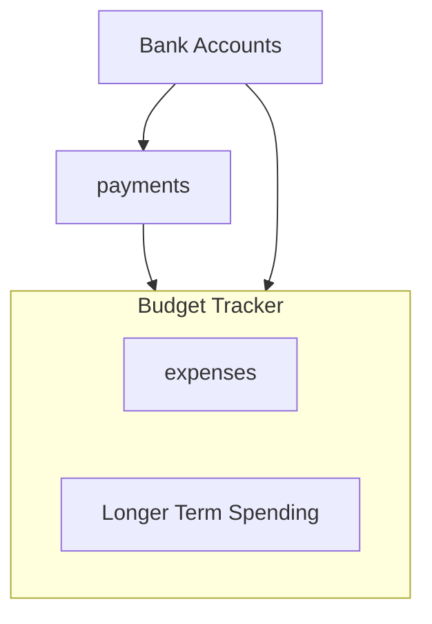
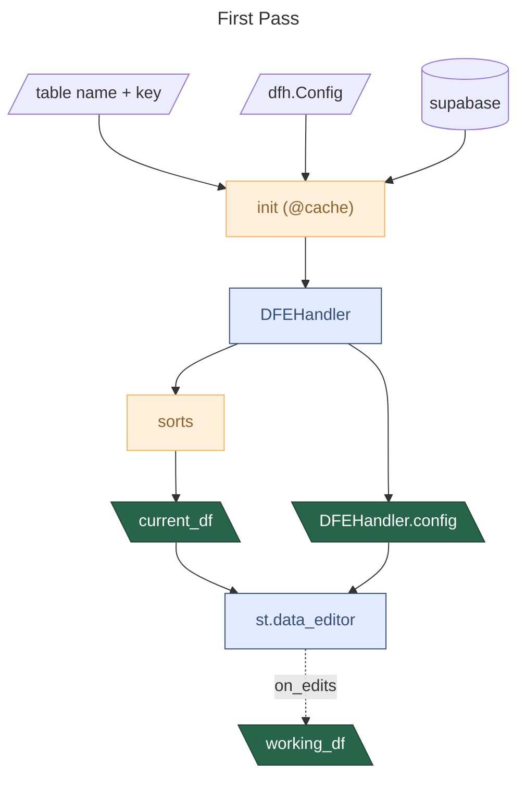
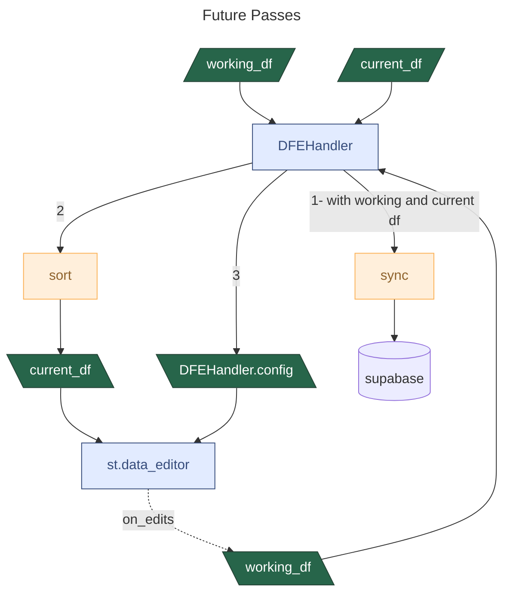

# finance-tracker

This app helps manage your personal finances!

## Management flow

```mermaid
flowchart TB
    bank_accounts["Bank Accounts"] --> payments
    payments --> budget_tracker
    bank_accounts --> budget_tracker
    subgraph budget_tracker["Budget Tracker"]
        expenses
        longer_term_spending["Longer Term Spending"]
    end

```

## DFE workflow

For the first pass:

```mermaid
---
title: First Pass
---
flowchart TD
    n2["DFEHandler"] --> n7["DFEHandler.config"] & n10["sorts"]
    n6["st.data_editor"] -. on_edits .-> n8["working_df"]
    n5["current_df"] --> n6
    n7 --> n6
    n4["table name + key"] --> n9["init (@cache)"]
    n3["dfh.Config"] --> n9
    n1["supabase"] --> n9
    n9 --> n2
    n10 --> n5
    n7@{ shape: out-in}
    n8@{ shape: out-in}
    n5@{ shape: out-in}
    n4@{ shape: in-out}
    n3@{ shape: in-out}
    n1@{ shape: db}
     n2:::Aqua
     n2:::Sky
     n7:::Pine
     n10:::Peach
     n6:::Sky
     n8:::Pine
     n5:::Pine
     n9:::Peach
    classDef Aqua stroke-width:1px, stroke-dasharray:none, stroke:#46EDC8, fill:#DEFFF8, color:#378E7A
    classDef Sky stroke-width:1px, stroke-dasharray:none, stroke:#374D7C, fill:#E2EBFF, color:#374D7C
    classDef Pine stroke-width:1px, stroke-dasharray:none, stroke:#254336, fill:#27654A, color:#FFFFFF
    classDef Peach stroke-width:1px, stroke-dasharray:none, stroke:#FBB35A, fill:#FFEFDB, color:#8F632D


```

For future passes:

```mermaid
---
title: Future Passes
---
flowchart TD
    n2["DFEHandler"] -- 3 --> n7["DFEHandler.config"]
    n2 -- 2 --> n11["sort"]
    n2 -- "1- with working and current df" --> n10["sync"]
    n6["st.data_editor"] -. on_edits .-> n8["working_df"]
    n5["current_df"] --> n6
    n7 --> n6
    n9["working_df"] --> n2
    n10 --> n1["supabase"]
    n8 --> n2
    n11 --> n5
    n12["current_df"] --> n2
    n7@{ shape: out-in}
    n8@{ shape: out-in}
    n5@{ shape: out-in}
    n9@{ shape: in-out}
    n1@{ shape: db}
    n12@{ shape: in-out}
     n2:::Aqua
     n2:::Sky
     n7:::Pine
     n11:::Peach
     n10:::Peach
     n6:::Sky
     n8:::Pine
     n5:::Pine
     n9:::Pine
     n12:::Pine
    classDef Aqua stroke-width:1px, stroke-dasharray:none, stroke:#46EDC8, fill:#DEFFF8, color:#378E7A
    classDef Sky stroke-width:1px, stroke-dasharray:none, stroke:#374D7C, fill:#E2EBFF, color:#374D7C
    classDef Pine stroke-width:1px, stroke-dasharray:none, stroke:#254336, fill:#27654A, color:#FFFFFF
    classDef Peach stroke-width:1px, stroke-dasharray:none, stroke:#FBB35A, fill:#FFEFDB, color:#8F632D

```
