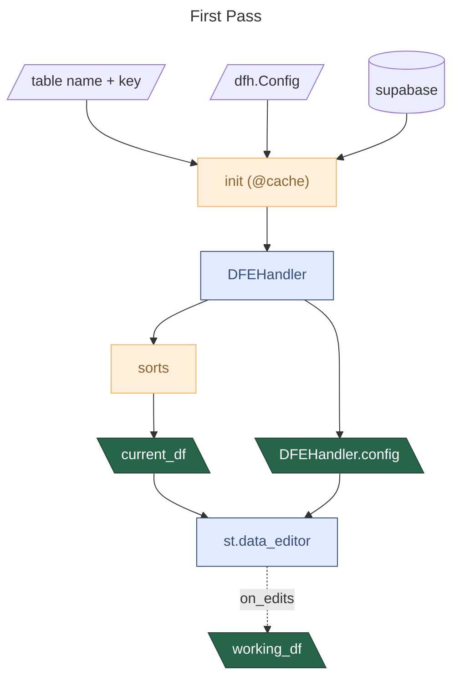
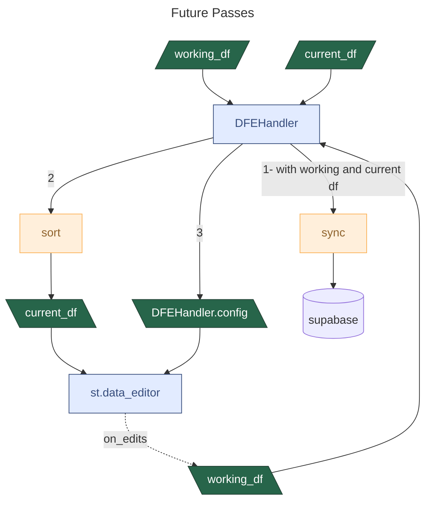
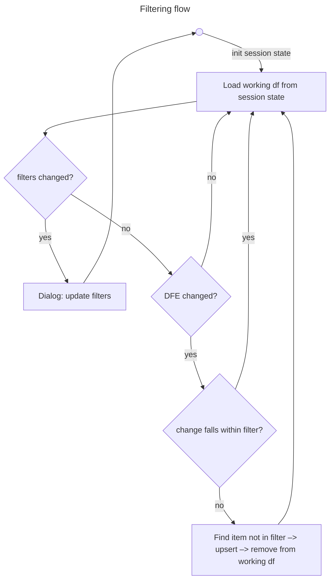
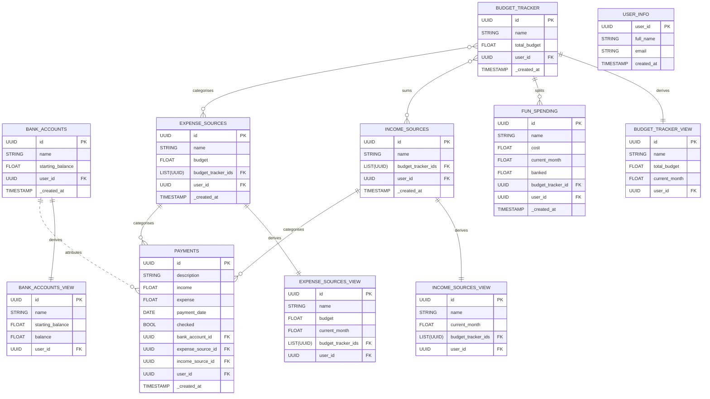

# finance-tracker

This app helps manage your personal finances!

## DFE workflow

For the first pass:



For future passes:



### Filtering



##  Backend design



### Example expense sources view

```SQL
CREATE OR REPLACE VIEW EXPENSE_SOURCES_VIEW AS
SELECT
    es.id,
    es.name,
    es.budget,
    COALESCE(SUM(p.income - p.expense), 0) AS current_month,
    es.budget_tracker_ids,
    es._created_at
FROM
    EXPENSE_SOURCES es
LEFT JOIN
    PAYMENTS p
ON
    es.id = p.expense_source_id
WHERE
    p.payment_date BETWEEN $1 AND $2
GROUP BY
    es.id, es.name, es.budget, es.budget_tracker_ids, es._created_at;
```

### Budget Tracker view

```SQL
CREATE OR REPLACE VIEW BUDGET_TRACKER_VIEW AS
SELECT
    bt.id,
    bt.name,
    bt.total_budget,
    bt._created_at,
    COALESCE(SUM(esv.current_month), 0) AS current_month
FROM
    BUDGET_TRACKER bt
LEFT JOIN
    EXPENSE_SOURCES es ON bt.id = ANY(es.budget_tracker_ids)
LEFT JOIN
    EXPENSE_SOURCES_VIEW esv ON es.id = esv.id
LEFT JOIN
    INCOME_SOURCES is ON bt.id = ANY(is.budget_tracker_ids)
LEFT JOIN
    INCOME_SOURCES_VIEW isv ON is.id = isv.id
GROUP BY
    bt.id, bt.name, bt.total_budget, bt._created_at;
```

### Payments example

```SQL
CREATE TABLE PAYMENTS (
    id UUID PRIMARY KEY,
    description TEXT,
    income FLOAT,
    expense FLOAT,
    payment_date DATE,
    checked BOOLEAN,
    bank_account_id UUID REFERENCES BANK_ACCOUNTS(id),
    expense_source_id UUID REFERENCES EXPENSE_SOURCES(id),
    income_source_id UUID REFERENCES INCOME_SOURCES(id),
    user_id UUID REFERENCES USER_INFO(user_id),
    _created_at TIMESTAMP
)
```

###
